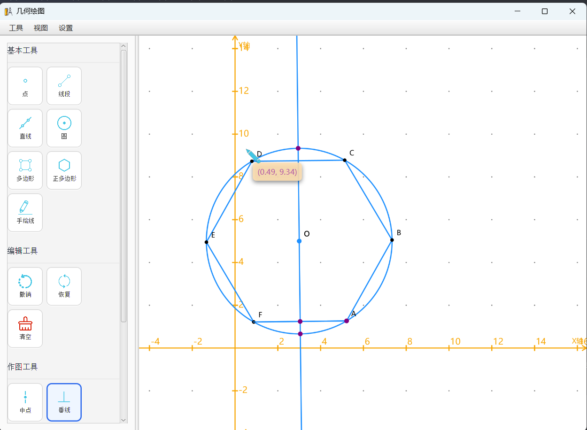

# FXGeometricView - 几何绘图工具

[](https://openjfx.io/)
[](LICENSE)

一款基于 JavaFX 开发的交互式几何绘图应用程序，支持基本几何图形绘制、函数图像绘制、手绘线平滑处理等功能。适用于数学教学、几何作图、函数可视化等场景。



## ✨ 功能特性

### 基本绘图工具

- **点** - 创建独立点或约束点
- **线段/直线** - 绘制线段和无限延伸的直线
- **圆** - 通过圆心和半径绘制圆
- **多边形** - 绘制任意多边形和正多边形
- **手绘线** - 自由绘制并自动平滑处理

### 编辑功能

- **撤销/重做** (Ctrl+Z / Ctrl+Y) - 支持无限级撤销
- **选择与拖动** - 拖拽图形顶点或整体移动
- **删除** (Delete) - 删除选中对象
- **清空画布** - 一键清空所有内容
- **层级管理** - 上移、下移、置顶、置底

### 作图工具

- **中点** - 自动计算线段中点
- **垂线/垂直平分线** - 绘制垂线和垂直平分线
- **平行线** - 绘制平行线
- **切线** - 绘制圆的切线
- **旋转** - 对图形进行旋转变换

### 函数绘制

支持多种函数类型：

- 线性函数：y = kx + b
- 二次函数：y = ax² + bx + c
- 三角函数：sin, cos, tan
- 指数函数和对数函数
- 双曲线、抛物线、椭圆
- 反比例函数

### 视图与网格

- **多种网格模式** - 点模式、网格模式、极坐标网格、等距网格
- **坐标轴显示/隐藏** - 可配置的笛卡尔坐标系
- **缩放与平移** - 鼠标滚轮缩放，拖拽平移
- **吸附功能** - 自动吸附到网格点

### 手绘线平滑算法

采用多种算法对手绘线进行平滑处理：

- **高斯平滑** - 去除高频噪声
- **尖刺点去除** - 基于角度检测去除异常点
- **Douglas-Peucker 简化** - 保留关键点，简化路径
- **Catmull-Rom 样条曲线** - 生成平滑曲线
- **参数可调** - 通过"绘制设置"窗口实时调节平滑参数

## 🚀 快速开始

### 环境要求

- **JDK**: 17 或更高版本
- **Maven**: 3.6 或更高版本
- **操作系统**: Windows / macOS / Linux

### 编译运行

```bash
# 克隆项目
git clone <repository-url>
cd FXGeometricView

# 编译并打包
mvn clean package

# 运行应用程序
java -jar bin/FXGeometricView-1.0-SNAPSHOT.jar
```

### 开发模式运行

```bash
# 使用 JavaFX Maven 插件运行
mvn javafx:run
```

## 📖 使用说明

### 基本操作

| 操作      | 说明             |
|---------|----------------|
| 左键点击/拖拽 | 绘制图形、选择对象、拖动顶点 |
| 右键点击    | 打开上下文菜单        |
| 滚轮      | 缩放视图           |
| 中键拖拽    | 平移视图           |
| ESC     | 取消当前操作 / 清除选择  |
| Delete  | 删除选中对象         |

### 快捷键

| 快捷键              | 功能      |
|------------------|---------|
| Ctrl + Z         | 撤销      |
| Ctrl + Y         | 重做      |
| Ctrl + Shift + P | 截图      |
| ESC              | 取消/清除选择 |
| Delete           | 删除选中对象  |

### 手绘线参数设置

通过菜单 **设置 → 绘制设置** 可以调整以下参数：

| 参数     | 说明            | 建议范围       |
|--------|---------------|------------|
| 简化容差   | 控制关键点保留程度     | 0.3 - 2.0  |
| 平滑细分数  | 曲线平滑程度        | 12 - 20    |
| 张力系数   | 曲线紧绷程度（越小越平滑） | 0.4 - 0.6  |
| 最小采样距离 | 过滤过密点         | 0.01 - 0.2 |

## 🏗️ 项目结构

```
FXGeometricView/
├── src/
│   ├── main/
│   │   ├── java/
│   │   │   └── com/bingbaihanji/
│   │   │       ├── FXGeometricApplication.java    # 应用程序入口
│   │   │       ├── config/                         # 配置管理
│   │   │       ├── constant/                       # 常量定义
│   │   │       ├── controller/                     # 控制器（MVC）
│   │   │       │   ├── DrawingController.java      # 主绘制控制器
│   │   │       │   └── handler/                    # 事件处理器
│   │   │       ├── factory/                        # 工厂类
│   │   │       ├── model/                          # 数据模型
│   │   │       ├── util/                           # 工具类
│   │   │       │   ├── CurveSmoothing.java         # 曲线平滑算法
│   │   │       │   └── ...                         # 其他工具
│   │   │       ├── view/                           # 视图层
│   │   │       │   ├── menu/                       # 菜单和对话框
│   │   │       │   ├── layout/                     # 布局组件
│   │   │       │   │   ├── core/                   # 核心视图组件
│   │   │       │   │   └── draw/                   # 绘制相关
│   │   │       │   └── ...
│   │   │       └── strategy/                       # 策略模式实现
│   │   └── resources/
│   │       ├── language/                           # 国际化资源
│   │       │   ├── language_zh_CN.properties       # 中文
│   │       │   ├── language_en_US.properties       # 英文
│   │       │   └── language_ja_JP.properties       # 日文
│   │       ├── icon/                               # 图标资源
│   │       └── logo.png                            # 应用图标
│   └── test/                                       # 测试代码
├── bin/                                            # 构建输出目录
├── pom.xml                                         # Maven 配置
└── README.md                                       # 本文件
```

## 🛠️ 技术栈

- **Java 17** - 主要编程语言
- **JavaFX 21** - 图形用户界面框架
- **Maven** - 构建工具
- **SLF4J + Logback** - 日志框架
- **Apache Commons Math** - 数学计算库
- **JUnit 5** - 单元测试框架

## 🌍 国际化支持

支持三种语言界面：

- 🇨🇳 简体中文
- 🇺🇸 English
- 🇯🇵 日本語

语言可通过 **设置 → 系统设置** 进行切换。

## 📝 开发计划

- [x] 基本几何图形绘制
- [x] 手绘线平滑处理
- [x] 函数图像绘制
- [x] 多语言支持
- [x] 撤销/重做系统
- [ ] 动画演示功能
- [ ] 脚本扩展支持

## 🤝 贡献指南

欢迎提交 Issue 和 Pull Request！

1. Fork 本仓库
2. 创建特性分支 (`git checkout -b feature/AmazingFeature`)
3. 提交更改 (`git commit -m 'Add some AmazingFeature'`)
4. 推送到分支 (`git push origin feature/AmazingFeature`)
5. 打开 Pull Request

## 📄 许可证

本项目基于 [MIT License](LICENSE) 开源。

## 👤 作者

**bingbaihanji** - [GitHub](https://github.com/bingbaihanji)

---

> 💡 **提示**：如遇问题，请查看 [Issues](../../issues) 页面或提交新的 Issue。
